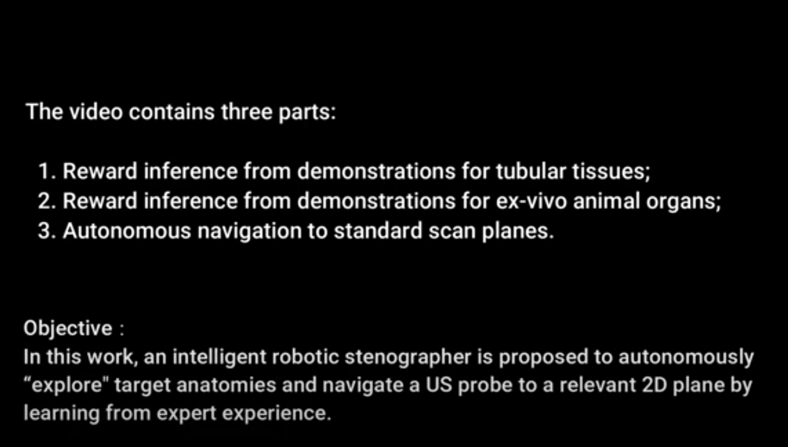

# Intelligent Robotic Sonographer: Mutual Information-based Disentangled Reward Learning from Few Demonstrations

#### Introduction
his work proposes an intelligent robotic sonographer to autonomously “explore” target anatomies and navigate a US probe to standard planes by learning from the expert. The underlying high-level physiological knowledge from experts is inferred by a neural reward function, using a ranked pairwise image comparisons approach in a self-supervised fashion. This process can be referred to as understanding the “language of sonography”.
<div align="center">

</div>
Considering the generalization capability to overcome inter-patient variations, mutual information is estimated by a network to explicitly disentangle the task-related and domain features in latent space.
<div align="center">

</div>

#### Video Demo
[](https://www.youtube.com/watch?v=u4ThAA9onE0)


#### Citation
If you found this work interesting and adopted part of it to your own research, or if this work inspires your research, you can cite our paper by:

```
@article{jiang2023intelligent,
  title={Intelligent robotic sonographer: Mutual information-based disentangled reward learning from few demonstrations},
  author={Jiang, Zhongliang and
          Bi, Yuan and
          Zhou, Mingchuan and
          Hu, Ying and
          Burke, Michael and
          Navab, Nassir},
  journal={The International Journal of Robotics Research},
  pages={02783649231223547},
  publisher={SAGE Publications Sage UK: London, England}
}
```
